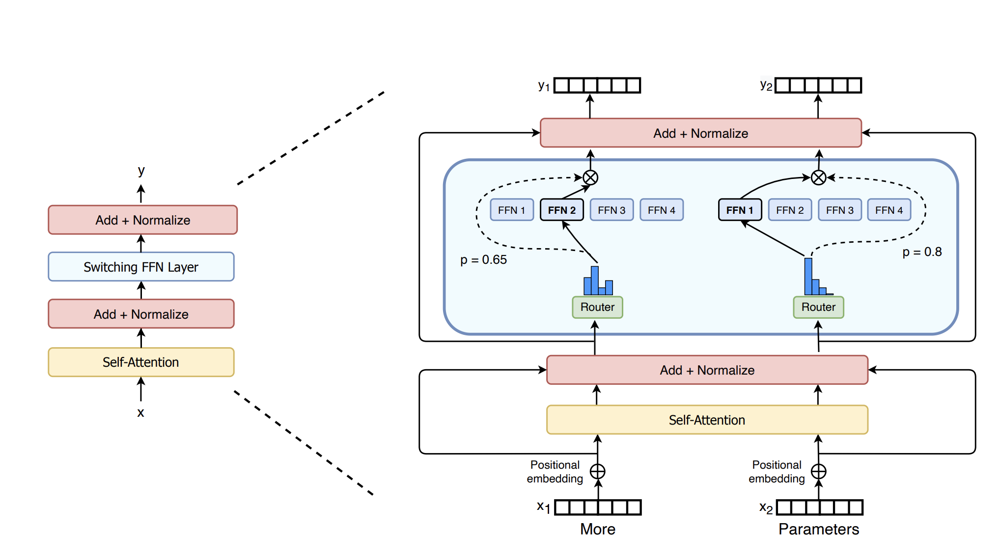
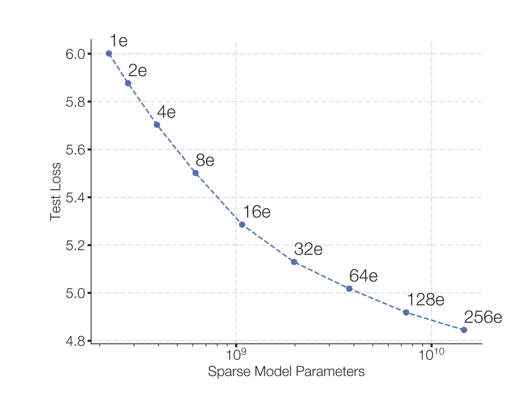
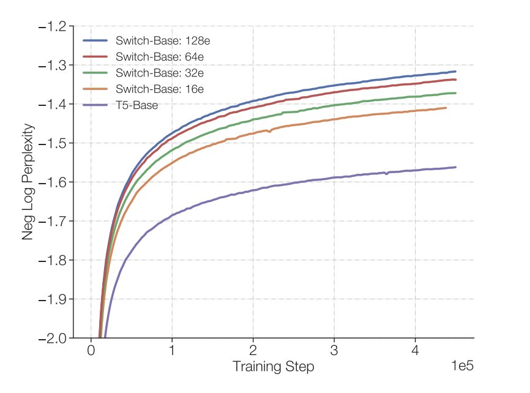
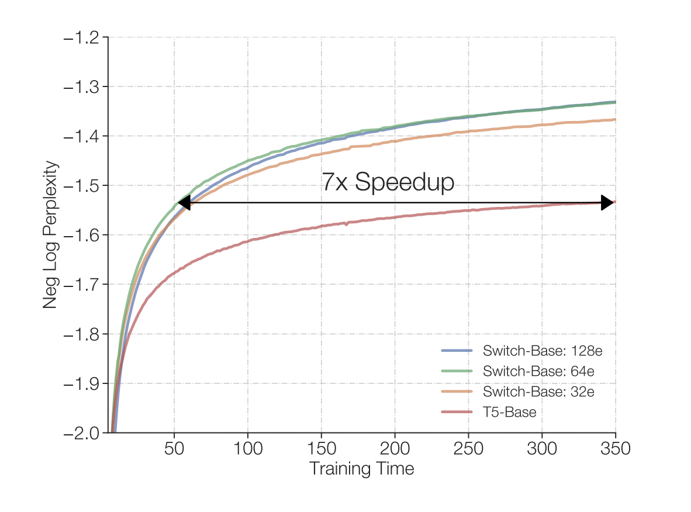
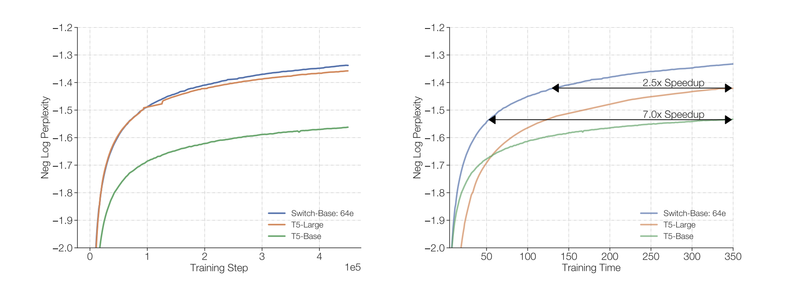

In this short post, I am going to talk about the Switch Transformer paper.

## Background and Architecture

To begin: In Dense Models, each parameter/neuron of the network gets activated during the forward pass. 

Hence, to be able to derive more performance by means of increasing the model size, more computation is required. Implicitly, more model parameters => more computation performed by a single token.
And tangential to this, work by [Kaplan et al. (2020)](https://arxiv.org/abs/2001.08361) becomes super relevant as they discuss training larger models on comparatively smaller amounts of data as the computationally optimal approach.

So, the point is that while increasing the number of model parameters yields performance, it comes at the cost of increased total computation/FLOPs per token (There's nuance to the former part of this statement but it communicates the gist).

Such is not the case with Routed Models as we'll see. Let's first look at what a "Routed Layer" looks like.

The above figure might seem intimidating but we'll understand all of it.
The single feed forward layer is replaced by several *different* FF layers (FF1 through FF4 in the figure) each of which is called an *Expert*. Each token is routed to only one of the experts during a single forward pass. The Router (in green) is yet another FFNN that decides which expert should each token be routed to. And to make it clear, the same router is used for all tokens.

### Let's look at some math
Consider,
- \\( \mathcal{B} \\): the current batch 
- \\( T \\): number of tokens in the current batch
- \\( N \\): the number of experts in the current routed layer
- \\( E_i \\): the expert \\( i \\)
- \\( p_i(x) \\): the probability that the token \\( x \\) is routed to \\( E_i \\)

The Router, as discussed, is a FFNN that takes \\( x \\) as an input and first produces logits given by:
$$ h(x) = W_r . x $$

where,

\\( W_r \\): The router weights 

Talk of probability in FFNNs and you have softmax; hence the router probability for a particular expert \\( E_i \\) is calculated by normalizing the logits as:

$$ p_i(x) = \frac{e^{h(x)&lowbar;i}}{\sum&lowbar;{j=1}&Hat;{N} e^{h(x)&lowbar;j}} $$

From here, as can be seen in the figure above, the Switch paper routes \\( x \\) to the expert with the highest \\( p_i(x) \\).

And thereupon the output corresponding to token \\( x \\) is calculated as:

$$ y = p_i(x)E_i(x); i \in {1, 2, ..., N} $$

This is what the dotted line in the figure shows.

To revise: we went from a layer with a single feed forward network to what the paper calls a "Switch layer".

## What happened here?
The architectural change was straight forward to understand: you replace the single FF network with a bunch of different FF networks, of which one token uses only one at a time. What this means is that while the total parameters in the layer increase this way by \\( N \\) times, the total computation performed by each token remained constant.

And so here we go: We are able to scale on the number-of-parameters axis while keeping the FLOPs per token constant. All of this by virtue of the routing mechanism that introduces "sparsity" in the model -- not all parameters of the model are activated during a token's forward pass.

## Revising the Switch Layer: MoE vs Switch Transformer
As we saw above, one token is routed to only one expert at a time in the Switch Transformer paper. 

The Outrageously Large Neural Networks paper (Shazeer et al. 2017) does this differently. Instead of routing a token to only one expert, they select the top-k experts for a token, in which case the output of the MoE layer (they call it that) for that token becomes:

$$ y = \sum&lowbar;{i \in \mathcal{T}} p_i(x)E_i(x) $$

where, 

\\( \mathcal{T} \\): set of top-k Experts

### Why top-k?
I read the OLNN paper carefully but did not see any elaborate mentions of why \\( k>1 \\) experts are required. But what the paper nicely elaborates on is "load-balancing". We'll circle back to load-balancing in context of the Switch paper but the term essentially means to ensure that all experts are sufficiently utilized and hence trained during the training process. In other words, the router shouldn't always favour a certain (set of) expert(s).

And from here, one can intuition about why the authors chose \\( k>1 \\) (precisely they use \\( k=4 \\)) -- to make sure that not just one but more than one expert is involved during any single backprop for the router to be able learn the routing process without favouring a single (set of) expert(s).

That said, if \\( k>1 \\) is one aspect of load-balancing along with playing a part in making sure all experts are sufficiently trained, how were the Switch authors able to do well without it?

## Auxiliary loss
This section is the answer to that.
The aux loss is just a term that's added to the total model loss. The purpose of it is to penalize the router for favouring a certain expert too much, i.e. for giving too large a probability to any one expert. Hence, this loss encourages a "uniform routing". The word "uniform" here is more than an english word; it's used in the statistical sense of the Uniform Distribution and logically so. Because what we want is for the tokens to be distributed uniformly among the experts.

And we will see how exactly does this loss encourages a Uniform Distribution. But let's see the math once.

Keeping the previous notations same, consider:
- \\( f_i \\): the fraction of tokens routed to \\( E_i \\)

Hence,

\\( f_i \\) = Number of tokens from \\( \mathcal{B} \\) router to \\( E_i \\) / Total tokens in \\( \mathcal{B} \\)

$$ f_i = \frac{1}{T} \sum_{x \in \mathcal{B}} \mathbb{1} \\{argmax \ p(x) = i \\} $$

- \\( P_i \\): fraction of the router probability assigned to \\( E_i \\) across all tokens in \\( \mathcal{B} \\)

Hence,

\\( P_i \\) = Sum of \\( p_i(x) \\) across \\( \mathcal{B} \\) / Total router probability across \\( \mathcal{B} \\)

$$ P_i = \frac{1}{T} \sum_{x \in \mathcal{B}} p_i(x) $$

The aux loss is now given by:

$$ loss = \alpha . N . \sum&lowbar;{i=1}&Hat;{N} f_i . P_i $$

where,

\\( \alpha \\): coefficient to control the effect of aux losses
It needs to be large enough for the aux losses to have a sufficient load-balancing effect, and small enough to not overwhelm the primary modelling loss.

Now, under Uniform routing (which is what we want), each expert should get \\( \frac{T}{N} \\) tokens routed to it. And for every particular \\( x \\), \\( p_i(x) \\) should be \\( \frac{1}{N} \\) for each value of \\( i \\) i.e. for each expert.

Hence, under uniform routing:

$$ f_i = \frac{1}{T} x \frac{T}{N} = \frac{1}{N} $$
$$ P_i = \frac{1}{T} x \sum&lowbar;{x \in \mathcal{B}} \frac{1}{N} = \frac{1}{T} x \frac{T}{N} = \frac{1}{N} $$

And these are the exact values at which the aux loss as described above is minimized, and hence it encourages uniform routing! 

[Notice the term \\( N \\) multiplied in the aux loss equation? Plug in these uniform values and try to reason why it's necessary.]

Obviously, there's more than a single switch layer in the full architecture, and we want each one of it to route uniformly. So, aux losses corresponding to each switch layer are calculated and added to the language model training loss.

### Benefits of \\( k=1 \\) (The Switch Layer)
Choosing \\( k=1 \\) over \\( k>1 \\) results in some obvious benefits:
1. Less computation needs to be performed per token.
2. Cross device communication is reduced owing to the needlessness to perform an addition operation to be able to get the token output.

## Efficient routing: Expert Capacity
The Expert Capacity of each expert which is basically the max batch size allocated to each expert. It goes:

$$ \text{expert capacity} = \left( \frac{\text{tokens per batch}}{\text{number of experts}} \right) \times \text{capacity factor} $$

As is clear, the capacity factor is introduced in the above equation to create an additional buffer for cases when there's an unequal allocation of tokens among the experts by the router. If the router allocated count exceeds the Expert Capacity, the extra tokens are just dropped from the expert computation (and make their way to the next layer via the residual connection).

Now a natural question is that why is this additional constraint even required and why can't we just have the router route however it wants with the flexibility to increase the Expert Capacity indefinitely? At once, load balancing might come up as one reason but if thought carefully, Expert Capacity doesn't really do anything in that sense. As in it's not encouraging balancing in the sense of causing other experts to be equally utilized simply because the extra tokens are just dropped and not like re-routed to some other expert(s).

The reason why Expert Capacity is needed is to make sure that resources (computation and memory) are not wasted while some expert operates at its full capacity and others don't; and obviously this is also the reason why we don't want to have too large of an expert capacity. The goal is to strike a good balance so that not many tokens are dropped (the authors empirically prove that a lower drop rate is important to scale these models) and not a lot of resources are wasted.

[I realise that this reasoning might still remain a bit unclear or atleast too abstract to grasp to those that don't have a clear understanding of the GPU arch, resource management, memory allocation on the devices etc. The insight here is that if the expert capacity of each expert is set to very high, it will be a waste for those experts that do not process as many tokens. GPUs are expensive and we don't want resources to be idle.]

## Scaling Laws
There are a couple interesting plots in the paper showing scaling on the number-of-experts axis.
Note that increasing the number of experts does not increase the FLOPs per token and hence the models remain *FLOPs matched* -- the computation budget per token remains constant.

1. More experts = Better test loss
The plot below clearly shows that as the number of experts increase the test loss decreases. Ofcourse, everything else (#tokens, #training steps etc.) must be kept constant.

2. More experts = Fast training
Firstly, fast here does not mean more examples processed per second.
Fast implies what can be clearly seen in the plot below: Having more experts achieves the same level of negative log perplexity faster than a model with lesser experts -- faster in terms of the number of training steps performed.

Additionally, the authors also find for a fixed number of tokens seen, larger models learn faster.

What needs to be carefully noted here is that while the total computation performed per token (FLOPs per token) is constant across models with varying number of experts, a relatively very small computation difference is there by virtue of the router having to compute as many probailities as there are the number of experts; but this is minor. 
Consequently, we also note that there's no router calculations at all in dense models. And additionally, Switch transformer also needs to do some extra communication across devices by virtue of the different experts being on different devices.

This leads us to an important point: Being faster on the numnber-of-training steps axis does not necessarily mean being faster on the time-taken-by-the-wall-clock axis. Again, the premise here is that the Switch Transformer, owing to the extra computation and communication that it needs to do, might complete a certain number of training steps slower than its dense counterpart.
This means that while we expect the Switch Transformer to be better performing after completing the same number of training steps as the dense model, it can still take more time for the former to actually reach that point.

So the next obvious question is: Given a fixed amount of wall clock time (and ofcourse the computation budget), how do these models compare in performance with each other?

3. Fixed training time
The plot below answers the question posed just above - For a fixed training duration, Switch transformer outperforms the dense model. Same story for the number of experts as they grow, but here the difference isn't as significant and the intuition is pretty easy to reach at if the past few paras were clear enough.

4. Moving forward to *FLOPs un-matched*
If we go back to the motivation behind using a MoE or a sparse routed model like the Switch Transformer, it's simply stated as: MoEs allow us to increase the parameter count while keeping the computational budget constant.

While the benefit of training an MoE/Switch model over its FLOPs matched baseline is clear by now, how does a Switch model compare with a more-FLOPs-demanding dense baseline? The plot below shows that Switch-Base (124B FLOPs/seq) is still more sample efficient than dense T5-Large (425B FLOPs/seq). This is cool!

## Let's "infer" the tradeoff!
Now, let's "infer" a tradeoff from whatever we've studied till now. I am using those quotes because the tradeoff is regarding the Inference stage. :-)

The obvious reason being that all the experts need to be loaded 
As we've seen, with the same amount of computational budget, MoE/Switch performs better than the FLOPs matched dense baseline owing to ofcourse, the greater number of parameters that it has. What this also means for the inference stage is that the former requires more memory than the latter in exchange of the performance gains that it offers. The obvious reason being that all the experts need to be loaded in the memory.

Hence, it's a memory vs performance tradeoff.

## References
[1] [Switch Transformers: Scaling to Trillion Parameter Models with Simple and Efficient Sparsity](https://arxiv.org/pdf/2101.03961)

[2] [Outrageously Large Neural Networks: The Sparsely-Gated Mixture-of-Experts Layer](https://arxiv.org/abs/1701.06538)