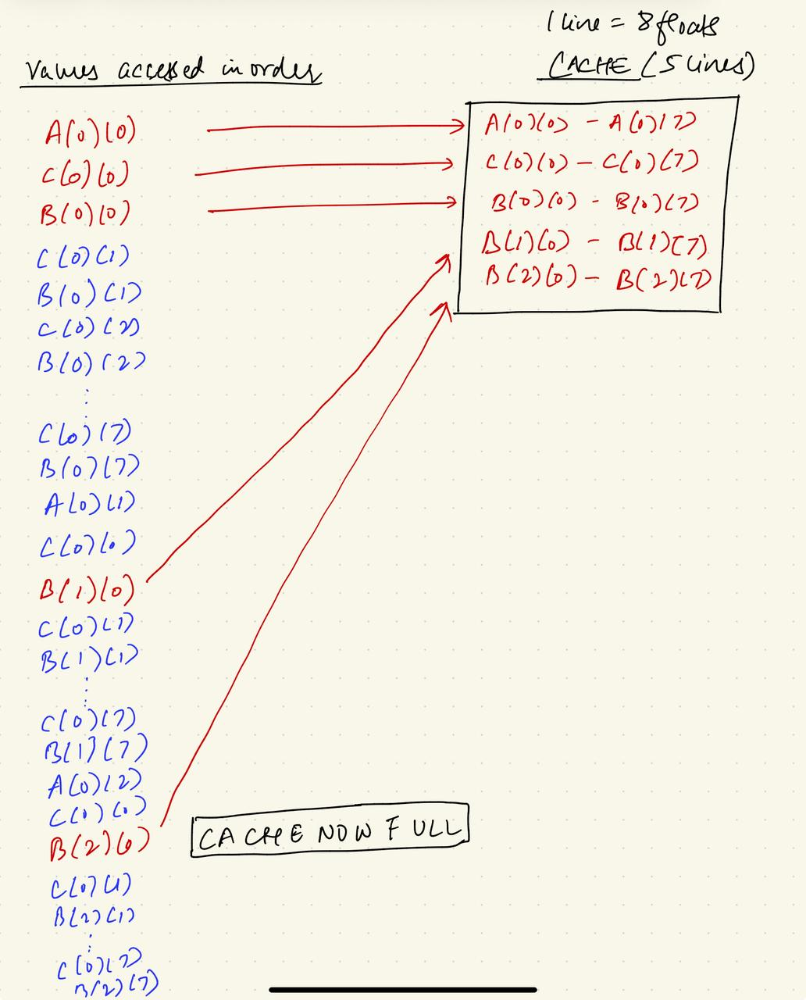

## Introduction and Setup
This blog starts with a naive implementation of matmul in C and optimizes it one step at a time. 

I am using [the following machine](https://www.apple.com/in/shop/buy-mac/macbook-pro/14-inch-space-black-standard-display-apple-m5-chip-with-10-core-cpu-and-10-core-gpu-16gb-memory-512gb) with a 10 core CPU (4 Performance cores+6 Efficiency cores). 
 

Food for thought: Is matrix multiplication on CPU compute bound or memory bound? Think about it...


## Algorithmic complexity of Matrix Multiplication: Calculating the FLOPs required
Matrix multiplication is ubiquitous in many areas of computer sciene. As the matrices grow in sizes, the amount of FLOPs required to calculate the matmul grow cubically[^1]. Let's see how. 

Consider two matrices $A (i \times k)$ and $B (k \times j)$. The product of $A$ and $B$, $AB$ is a matrix $C$ of shape $(i \times j)$.

For simplicity and without loss of generality, let's consider the matrices to be square so we have $A (n \times n)$, $B (n \times n)$ and their product $C (n \times n)$. One element $(c_1, c_2)$ of $C$ is defined as:

$$c_{c1,c2} = \sum_{x=1}^{n} a_{c1,x} b_{x,c2}$$

This is a total of 2n - 1 floating point operations (FLOPs) required to calculate one element of C -- $n$ multiplication ops + $(n-1)$ addition ops. A total of $n^2$ elements need to be calculated in $C$ and hence the total FLOPs:

$$(2n - 1) n^2 = 2n^3 - n^2$$

As $n$ grows bigger (asymptomatic, if you're feeling fancy), $n^2$ becomes pretty negligible in comparison to $2n^3$ and hence can be ignored so the total FLOPs required is roughly $2n^3$. Therefore, the computational complexity is $O(n^3)$. 

For the purpose of this blog, I am considering two matrix sizes $N=4096$ and $N=8192$ which translates to roughly 137 and 1099 GFLOPs respectively. I initially started with $N=4096$ but because some optimization didn't yield any significant benefit for that size, I also decided to include $N=8192$. Anyway, those numbers seem like a lot of FLOPs, but they're rather pretty small if compared with the peak FLOPs offered by any standard modern processor.  

To benchmark, I calculated the time required to multiply numpy arrays using `np.matmul` and here are the results:

| Technique        | 4096 | 8192 |
| -----------------| ---- | ---- |
| Baseline (using np) | 0.10s | 0.78s |


## [Naive implementation](https://github.com/srishti-git1110/SGEMM-cpu/blob/main/sgemm-cpu/matmuls/naive.c)
The matmul loop is this:

```C
for (int i = 0; i < N; i++) {
    for (int j = 0; j < N; j++) {
        for (int k = 0; k < N; k++) {
            C[i][j] += A[i][k] * B[k][j];
        }
    }
}
```

When complied with the `-O3` flag[^2] which is the maximum level with safe optimizations, the latencies are as follows:


| Technique               | 4096     | 8192      | Speedup |
|------------------------|----------|-----------|---------|
| `Baseline (np)`        | `0.10 s` | `0.78 s`  | `–`     |
| `Naive implementation` | `203 s`  | `46 min`  | `-`    |


The speedup column for all further tables is calculated with respect to the row (optimization technique) just above so it simply gives an idea of the amount of improvement we get with a new intervention as compared to what we had just before it.

Full compilation command below:

```
gcc -Wall -O3 sgemm-cpu/matmuls/naive.c -o sgemm-cpu/matmuls/naive
```

All the further optimizations use the same flags to compile the code.

### [A minor optimization: Avoiding unnecessary memory accesses](https://github.com/srishti-git1110/SGEMM-cpu/blob/main/sgemm-cpu/matmuls/naive_register_accumulation.c)
A very small thing we could do with the naive implementation is avoiding multiple reads and writes of intermediate partial sums from and to the memory/cache, like so:

```C
for (int i = 0; i < N; i++) {
    for (int j = 0; j < N; j++) {
        float running_sum = 0.0;
        for (int k = 0; k < N; k++) {
            running_sum += A[i][k] * B[k][j];
        }
        C[i][j] = running_sum;
    }
}
```
The table below shows that helps very little for $N=4096$ but quite a lot for $N=8192$ [^3]:

| Technique               | 4096     | 8192      | Speedup ($N=4096$) | Speedup ($N=8192$) |
|------------------------|----------|-----------|---------|---------|
| `Baseline (np)`        | `0.10s` | `0.74s`  | `–`     | `–`     |
| `Naive implementation` | `203s`  | `46min`  | `-`    | `-`    |
| `Naive w register accumulation` | `199s` | `27min` | `1.02x` | `1.7x` |

This optimization is simply causing the compiler to keep the partial sum in the registers only and write back to the memory only once when the full sum is done. Meaning in this case the compiler isn't issuing separate instructions to store the partial sum back to the memory after every loop iteration and to load it back on the next iteration; and that reduces some latency [^4]. 


## [Loop reordering](https://github.com/srishti-git1110/SGEMM-cpu/blob/main/sgemm-cpu/matmuls/cache_aware.c)
The naive implementation follows the most natural mathy way to calculate a matmul $C = AB$ --- element $C[0][0]$ is *fully* calculated first via a scalar product of the first row of $A$ with the first column of $B$, element $C[0][1]$ is *fully* calculated next via the scalar product of the first row of $A$ with the second column of $B$, and so on. 

There are two key insights over here:
1. Languages like C store matrices in the memory in a row major format like this:


If we now follow the calculation of $C[0][0]$ in code, it's equivalent to completing the inner-most $k$ loop for $i=0, j=0$. 

The first part of the figure below uses 3 shades of red to color the values from $A, B, C$ that are accessed in the code during the calculation of $C[0][0]$. Focus on the location of these values in the memory by following the color. 


The figure quickly makes it clear that the accessed values for $A, C$ are close to each other in the memory while they're further apart for $B$. Now, remember that data is fetched from the memory in the caches in the granularity of cache lines. One cache line on my machine is of size 128 bytes which is equivalent to 32 single precision values. 

So on the very first loop iteration $i=0, j=0, k=0$, when $A[0][0], B[0][0], C[0][0]$ are fetched from the memory, the cache looks something like:


This is simply because a cache line loads contiguous values from the memory where the matrices are stored in a row major format.
On the second iteration $i=0, j=0, k=1$, we need $A[0][1], B[1][0], C[0][0]$ and while $A[0][1]$ and $C[0][0]$ are found in the cache, we have a miss for $B[1][0]$ that we need to fetch from the memory. And this holds for each iteration of the k-loop for $i=0, j=0$. Easy to figure out why -- our cache line is only 128 bytes (32 floats) while  each subsequent loop iteration accesses a value from B that's 4096 values apart from the value accessed in the last iteration. And this high cache miss rate explains the high latency we saw w the naive implementation.

What about the subsequent iterations for different values of j and i? Say $i=0, j=1, k=0$ when we need $B[0][1]$ that was a part of the cache line we loaded on $i=0, j=0, k=0$ --- that cache line most probably would get evicted from the cache till now. Hence, the cache miss rate still remains high.

👉 👉 👉 *This is actually a central recurring point of discussion: Some data that we load once gets evicted by the time we need it again making things go slower. In a few upcoming sections, we'll be revolving around this point making optimizations that aim to reuse the data in subsequent iterations by using it as much as needed (and possible) before its eviction.*


<!-- Hence, for the access pattern shown above, we're getting good cache hit rates for values of A and C but a very high miss rate for values of B -- at each loop iteration, we have a hit for $C[0][0]$, mostly hits for value of the first row of A but we have a cache miss for all the values of B involved ($B[0][0], B[1][0]...$). Simply because the cache line loads contigous values from the memory and owing to the row major storage in the memory, the different values of B involved in calculating $C[0][0]$ are 4096 values (4096x4 bytes) apart which well exceeds the size of a usual cache line.  -->

2. The second insight is not too difficult to understand -- if we just change the loop orders (eg. $jik$ or $jki$ etc. instead of the most natural  $ijk$), we'll still get the correct matmul. It's also why I was italicizing *fully* above. Thing is that with different loop orders we're not fully calculating each element of C in one full iteration of the innermost loop but that doesn't hurt the correctness of the matmul and that's easy to realise. Alright. Given that, we note that some loop orders have a better overall cache hit rate as compared to the naive $ijk$ order (btw some orders also have a worse rate than $ijk$!). And hence just by changing the orders, we'll be able to reduce the latency by not having to make as many high latency accesses to the memory. Experimenting w different orders, the lowest latency corresponds to order ikj as follows:

| Technique               | 4096     | 8192      | Speedup ($N=4096$) | Speedup ($N=8192$) |
|------------------------|----------|-----------|---------|---------|
| `Baseline (np)`        | `0.10s` | `0.74s`  | `–`     | `–`     |
| `Naive implementation ` | `203s`  | `46min`  | `-`    | `-`    |
| `Naive w register accumulation` | `199s` | `27min` | `1.02x` | `1.7x` |
| `Loop reordering (ikj)` | `4.31s` | `34.28s` | `46x` | `47x` |

```C
for (int i = 0; i < N; i++) {
    for (int k = 0; k < N; k++) {
        float a_ik = A[i][k];
        for (int j = 0; j < N; j++) {
            C[i][j] += a_ik * B[k][j];
        }
    }
}
```

### What was the bottleneck?
A simple loop reordering of our naive implementation provided a 45 fold improvement. That's a lot for such a simple change. What does this tell us? Obviously, we still performed total 137 GFLOPs so that part didn't change. Turns out, in the naive implementation our bottleneck was the memory bandwidth. Meaning the CPU execution units (ALUs) were bottlenecked by the latency of data transfer between the memory and the CPU, implying we were overall *memory bound in the naive implementation*. Of course, we cannot change the memory bandwidth towards a faster memory. So what did we do? We simply wrote the code such that it allows for better cache reuse in subsequent loop iters!

### What about the computation aspect?
// vectorization enabled by loop ordering - figured out by the compiler

### What about the minor optimization from [above](https://srishti-git1110.github.io/blog/matmul-cpu/#a-minor-optimization-avoiding-unnecessary-memory-accesses)?
Because with the reordered loops, we're not calculating the full result $C[i][j]$ in one iteration of the inner most loop, we can't avoid the loading and storing of partial sums anymore!

## Cache Blocking / Tiling
The long story short about tiling: it's all about enabling a better cache reuse. Nothing different from the goal of loop reordering.


Let's try to understand tiling by doing something boring. For our best loop order $ikj$, we start by looking at the values that are accessed by the inner $k, j$ loops for different values of $i$.

$(i=0, k=0-4095, j=0-4095)$

- $A[0][0], A[0][1], ... A[0][4095]$ --> A's 1st row
- $C[0][0], C[0][1], ... C[0][4095]$ --> C's 1st row
- $B[0][0], B[0][1], ... B[0][4095]$ --> B's 1st row
- $B[1][0], B[1][1], ... B[1][4095]$ --> B's 2nd row
...                                 
- $B[4095][0], B[4095][1], ... B[4095][4095]$ --> B's 4095th row


$(i=1, k=0-4095, j=0-4095)$

- $A[1][0], A[1][1], ... A[1][4095]$ --> A's 2nd row
- $C[1][0], C[1][1], ... C[1][4095]$ --> C's 2nd row
- $B[0][0], B[0][1], ... B[0][4095]$ --> B's 1st row
- $B[1][0], B[1][1], ... B[1][4095]$ --> B's 2nd row

...                                 


- $B[4095][0], B[4095][1], ... B[4095][4095]$ --> B's 4095th row

What do we infer? 

👉 At every iteration of the $i$ loop, the code accesses a different row of A and C but all the rows of B are accessed at each iteration. 


So far so good. Let's now take an example with smaller 8x8 matrices and see what caches actually look like with our best loop order. For the example, assume a fully associative cache following an LRU (least recently used) policy with a cache line of 32 bytes = 8 floats, and a cache size of 160 bytes = 5 cache lines.

The (terrible) figure below shows the values accessed in sequence for $i=0$, and the state of the cache at each step. Red denotes a cache miss requiring a cache update and blue denotes a cache hit with no cache update required. Note that by the time we end $k=2$ for, our cache is full. 




The figure below shows the program resumed from $k=3$. Also shown is the cache state at the end of $i=0$ after multiple evictions. Note how the first 5 rows of B had to be evicted even before reaching $i=1$.


Now what? Start $i=1$. The same story gets repeated and below are the various cache states showing how we need to load the *entire B matrix from the memory* to be able to finish $i=1$! Not even a single row found in cache when needed despite the fact that all of them were loaded in the previous iteration $i=0$.


Of course, this was true for our particular example that 1 cache line = 1 row, and no single row of B was found in the cache. In practice, the number of caches, their sizes, eviction policies, cache line sizes all matter in determining what rows/values are found but the general gist stated below remains the same. 

<!-- The gist is that by the time the control proceeds to a new value of i and tries to access certain values from B, they might already be evicted from the cache requiring them to be loaded them from the high latency DRAM. Further, to be able to store the newly loaded values in the cache, cache eviction will happen for certaiin other values of B that already exist from the previous i iteration -- and these values will again need to be loaded from the memory. -->

The gist: At each new value of i, we're having to load all or some rows (/partial rows depending on the cache line) of B from the high latency memory despite having them loaded in the previous iteration of i. We should definitely do better!

### k-tiling

Think about this: how about there was no eviction and hence no need to reload values of B at each new iteration of i? It'd have been great except that caches are limited and we cannot increase their size. How do we make peace with eviction? By using the data as much as we want before it's evicted. Meaning we load a few rows of B in the cache and use them for all the values of i so that we never require them again? Then load the next few and again use them for all the values of i. The same until we're done with all the rows of B. This is where the word tile comes from -- we're loading and utilizing one tile fully before evicting it. 


What I've described is tiling on the k-loop only. In code:

```C
for (int k_tile=0; k_tile<N; k_tile+=TILE_SIZE) {
    for (int i=0; i<N; i++) {
        int kend = (k_tile + TILE_SIZE > N) ? N : k_tile + TILE_SIZE; // check if this is expensive than an if
        for (int k=k_tile; k<kend; k++) {
            float a_ik = A[i][k];
            for (int j=0; j<N; j++) {
                C[i][j] += a_ik * B[k][j];
            }
        }
    }
}
```

After doing a good amount of search over different values of TILE_SIZE, I found k-tiling didn't really yield any benefit on my machine both for $N=4096$ and $N=8192$. This is probably because of the already large cache sizes of my machime.

### ijk tiling
Let's now separately understand the purpose of tiling rest of the two loops - i and j.

<u> Tiling on the j-loop </u>: With k-tiling rather than loading all the rows of $B$ in the cache for each iteration of $i$, we're covering a particular number of rows at a time that fit in the cache. But for these rows, we're still loading all the columns of $B$ (all values of $j$)! In the oversimplified example above, 1 row = 1 cache line but that obviously isn't the case with bigger matrices and hence, it'd further benefit for the cache hit rate to also tile on the $j$ loop. 
 

<u> Tiling on the i-loop </u>: Further with both $k$ and $j$ tiled, we'd still be needing all the rows of C (all values of i, but ofc not full rows due to j-tiling) in the cache multiple times for different values of `k_tile` and `j_tile`. And that might again lead to cache misses for certain values of $C$. And hence, it also benefits to tile on the $i$ loop which, combined with $j$ tiling, effectively translates to taking a sub-matrix of C and finishing all the calculations for it (covering all values of k) before proceeding to another sub-matrix. Of course, we cover all the k values in a tiled manner only.

In code, this looks like:

```C
for (int i_tile = 0; i_tile < N; i_tile += TILE_I) {
        int iend = (i_tile + TILE_I < N) ? i_tile + TILE_I : N;

        for (int j_tile = 0; j_tile < N; j_tile += TILE_J) {
            int jend = (j_tile + TILE_J < N) ? j_tile + TILE_J : N;

            /* for a certain tile of C (i_tile:iend, j_tile, jend) we now cover all values of k in our already
            discussed k-tiled manner */

            for (int k_tile = 0; k_tile < N; k_tile += TILE_K) {
                int kend = (k_tile + TILE_K < N) ? k_tile + TILE_K : N;

                for (int i = i_tile; i < iend; i++) {
                    for (int k = k_tile; k < kend; k++) {
                        float a_ik = A[i][k];
                        for (int j = j_tile; j < jend; j++) {
                            C[i][j] += a_ik * B[k][j];
                        }
                    }
                }
            }
        }
    }
```
<!-- With ijk-tiling, I didn't see any significant benefit for $N=4096$. The lowest latency of 3.16s corresponds to tile sizes 128, 256, 128 for ikj respectively. 
For $N=8192$, this reduced the latency from 34.28s for untiled to 26.20s for tile sizes 128 for all ikj. That's a decent amount of reduction there! -->

With ijk tiling, the results are as follows:

| Technique               | 4096     | 8192      | Speedup ($N=4096$) | Speedup ($N=8192$) |
|------------------------|----------|-----------|---------|---------|
| `Baseline (np)`        | `0.10s` | `0.74s`  | `–`     | `–`     |
| `Naive implementation ` | `203s`  | `46min`  | `-`    | `-`    |
| `Naive w register accumulation` | `199s` | `27min` | `1.02x` | `1.7x` |
| `Loop reordering (ikj)` | `4.31s` | `34.28s` | `46x` | `47x` |
| `ijk tiling (best tile sizes)` | `3.16s` | `26.20s` | `1.36` | `1.3x` |

The best tile size for $N=4096$ is 128, 256, 128 for ikj respectively, and for $N=8192$ is 128 for all ikj.


## Multithreading

| Technique               | 4096     | 8192      | Speedup ($N=4096$) | Speedup ($N=8192$) |
|------------------------|----------|-----------|---------|---------|
| `Baseline (np)`        | `0.10s` | `0.74s`  | `–`     | `–`     |
| `Naive implementation ` | `203s`  | `46min`  | `-`    | `-`    |
| `Naive w register accumulation` | `199s` | `27min` | `1.02x` | `1.7x` |
| `Loop reordering (ikj)` | `4.31s` | `34.28s` | `46x` | `47x` |
| `ijk tiling (best tile sizes)` | `3.16s` | `26.20s` | `1.36` | `1.3x` |
| `Multithreading` |  `1.19s` | `9.88s` | `2.6x` | `2.6x` |

[^1]: This is for the standard algorithm. There's other algos like [Strassen's](https://en.wikipedia.org/wiki/Strassen_algorithm) with better theoretical complexity.

[^2]: Explore all optimization levels [here](https://gcc.gnu.org/onlinedocs/gcc/Optimize-Options.html).

[^3]: But this optimization wasn't the reason why I decided to also run numbers for $N=8192$; the reason was ijk-tiling discussed later in the blog.

[^4]: Sometimes, the compiler might also consider it safe to skip the extra store/reload steps when we directly update $C[i][j]$ in every loop iteration. But other times it may not. So, we're just being explicit here and writing code such that the compiler would *always* consider it safe to not issue the extra store/reload instructions for the partial sums.